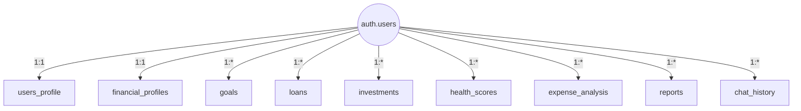

```mermaid
graph TD;
    auth_users((auth.users))
    users_profile[users_profile]
    financial_profiles[financial_profiles]
    goals[goals]
    loans[loans]
    investments[investments]
    health_scores[health_scores]
    expense_analysis[expense_analysis]
    reports[reports]
    chat_history[chat_history]

    auth_users -->|1:1| users_profile
    auth_users -->|1:1| financial_profiles
    auth_users -->|1:*| goals
    auth_users -->|1:*| loans
    auth_users -->|1:*| investments
    auth_users -->|1:*| health_scores
    auth_users -->|1:*| expense_analysis
    auth_users -->|1:*| reports
    auth_users -->|1:*| chat_history
```
